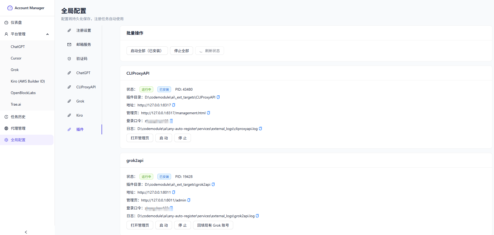

# Any Auto Register

<p align="center">
  <a href="https://linux.do" target="_blank">
    
  </a>
</p>

> ⚠️ 免责声明：本项目仅供学习和研究使用，不得用于任何商业用途。使用本项目所产生的一切后果由使用者自行承担。

多平台账号自动注册与管理系统，支持插件化扩展，内置 Web UI，并可自动拉起本地 Turnstile Solver。

## 项目来源 / 二开说明

- 本项目基于 [lxf746/any-auto-register](https://github.com/lxf746/any-auto-register.git) 二次开发。
- 当前仓库在原项目基础上，扩展了本地插件拉起、Grok 账号回填、任务历史批量删除、并发注册修复等能力。

## 插件与依赖地址说明

### 1. 临时邮箱项目来源

项目支持 Cloudflare Worker 自建临时邮箱，所使用的临时邮箱方案来源于：

- `https://github.com/dreamhunter2333/cloudflare_temp_email`

### 2. 三个插件的 Git 地址

项目支持按需安装/启动以下 3 个插件。当前代码里配置的 Git 地址如下：

| 项目                 | 用途                                 | Git 地址                                                   | 当前使用说明                                             |
| -------------------- | ------------------------------------ | ---------------------------------------------------------- | -------------------------------------------------------- |
| CLIProxyAPI          | CPA / 代理池管理服务                 | `https://github.com/router-for-me/CLIProxyAPI.git`       | 当前使用**GitHub 直连地址**，未额外套 Git 镜像代理 |
| grok2api             | Grok token 管理、回填、聊天/API 服务 | `https://github.com/chenyme/grok2api.git`                | 当前使用**GitHub 直连地址**，未额外套 Git 镜像代理 |
| kiro-account-manager | Kiro 账号管理相关插件                | `https://github.com/hj01857655/kiro-account-manager.git` | 当前使用**GitHub 直连地址**，未额外套 Git 镜像代理 |

> 如果后续你要改成 `ghproxy`、`gitclone`、企业 Git 镜像或其他代理地址，需要同步修改：
>
> `any-auto-register\services\external_apps.py`

## 功能特性

- 多平台支持：Trae.ai、Cursor、Kiro、Grok 等
- 多邮箱服务：MoeMail、Laoudo、DuckMail、Freemail、Cloudflare Worker 自建邮箱
- 多执行模式：协议模式、无头浏览器、有头浏览器
- 验证码服务：YesCaptcha、本地 Turnstile Solver（Camoufox）
- 代理池管理：自动轮询、成功率统计、自动禁用失效代理
- 并发注册：可配置并发数
- 实时日志：SSE 实时推送注册日志到前端

> ⚠️ **Kiro 邮箱说明**
>
> 由于 **Kiro 风控较严格**，邮箱方案对注册成功率影响很大。当前版本实测结果如下：
>
> - **Kiro 自建邮箱：成功率 100%**
> - **项目内置临时邮箱：成功率 0%**
>
> 因此，进行 **Kiro 相关注册** 时，请务必优先使用 **自建邮箱**，不要使用项目内置临时邮箱。

## 界面预览

### 仪表盘


### 全局配置 / 插件管理



## 技术栈

| 层级         | 技术                         |
| ------------ | ---------------------------- |
| 后端         | FastAPI + SQLite（SQLModel） |
| 前端         | React + TypeScript + Vite    |
| HTTP         | curl\_cffi                   |
| 浏览器自动化 | Playwright / Camoufox        |

## 环境要求

- Python 3.12+
- Node.js 18+
- Conda（推荐）

## 推荐环境

推荐固定使用 conda 环境名：

```bash
any-auto-register
```

本项目已经提供 Windows 启动脚本：

- `D:\codemodule\ai\any-auto-register\start_backend.bat`
- `D:\codemodule\ai\any-auto-register\start_backend.ps1`
- `D:\codemodule\ai\any-auto-register\stop_backend.bat`
- `D:\codemodule\ai\any-auto-register\stop_backend.ps1`

它们会强制通过 `any-auto-register` 环境启动后端，避免出现：

- 后端能启动，但 Solver 起不来
- `ModuleNotFoundError: quart`
- 前端里 Turnstile Solver 一直显示“未运行”

---

## 安装

### 1. 创建 conda 环境

```bash
conda create -n any-auto-register python=3.12 -y
conda activate any-auto-register
```

### 2. 安装后端依赖

```bash
pip install -r requirements.txt
```

### 3. 安装浏览器依赖

```bash
python -m playwright install chromium
python -m camoufox fetch
```

### 4. 安装并构建前端

```bash
cd frontend
npm install
npm run build
cd ..
```

构建完成后，前端静态文件会输出到：

```text
D:\codemodule\ai\any-auto-register\static
```

---

## 启动方式

### Windows 推荐启动方式

#### PowerShell

```powershell
.\start_backend.ps1
```

#### CMD

```bat
start_backend.bat
```

默认会使用：

- conda 环境：`any-auto-register`
- 服务地址：`http://localhost:8000`

### 手动启动方式

```bash
conda activate any-auto-register
python main.py
```

### 启动后访问

如果你已经执行过 `npm run build`，直接访问：

```text
http://localhost:8000
```

> 注意：生产/本地构建模式下，前端由 FastAPI 直接托管，访问的是 `8000`，不是 `5173`。

### 停止后端

#### PowerShell

```powershell
.\stop_backend.ps1
```

#### CMD

```bat
stop_backend.bat
```

默认会停止：

- 后端端口：`8000`
- Solver 端口：`8889`

---

## 前端开发模式

适合改 React 页面时使用。

### 终端 1：启动后端

```powershell
.\start_backend.ps1
```

### 终端 2：启动 Vite

```bash
cd frontend
npm run dev
```

然后访问：

```text
http://localhost:5173
```

Vite 会把 `/api` 代理到本地后端 `http://localhost:8000`。

---

## Turnstile Solver 说明

### 自动启动

本地 Turnstile Solver 会在 FastAPI 后端启动时自动拉起。

默认地址：

```text
http://localhost:8889
```

前端“全局配置 → 验证码 → Turnstile Solver”显示的是 **后端检测结果**，因此：

- 后端没启动 → 前端会显示“未运行”
- 后端启动了，但不是在正确 conda 环境里 → Solver 可能启动失败

### 手动启动 Solver

```bash
conda activate any-auto-register
python services/turnstile_solver/start.py --browser_type camoufox --port 8889
```

### Solver 日志

如果 Solver 启动失败，可查看：

```text
D:\codemodule\ai\any-auto-register\services\turnstile_solver\solver.log
```

---

## 常见问题排查

### 1. 前端里 Turnstile Solver 显示“未运行”

先检查后端是否启动：

```bash
curl http://localhost:8000/api/solver/status
```

正常结果示例：

```json
{"running":true}
```

如果 `8000` 端口都访问不到，说明是后端没启动，不是 Solver 本身的问题。

### 2. 出现 `ModuleNotFoundError: quart`

说明你当前启动后端的 Python 不是 `any-auto-register` 环境。

请改用：

```powershell
.\start_backend.ps1
```

或：

```bat
start_backend.bat
```

### 3. 如何确认当前 Python 是否正确

```bash
python -c "import sys; print(sys.executable)"
```

应当类似于：

```text
D:\miniconda\conda3\envs\any-auto-register\python.exe
```

### 4. Solver 能打开，但状态还是不对

检查这两个地址：

```text
http://localhost:8000/api/solver/status
http://localhost:8889/
```

只要第二个能开、但第一个不通，问题就在后端，不在 Solver。

### 5. 端口被占用

如果启动时报 `WinError 10048`，先执行：

```powershell
.\stop_backend.ps1
```

然后重新启动：

```powershell
.\start_backend.ps1
```

---

## 邮箱服务配置

> ⚠️ **Kiro 平台特别说明**
>
> Kiro 的风控策略较严格。当前版本实测：
>
> - **自建邮箱成功率：100%**
> - **内置临时邮箱成功率：0%**
>
> 如需注册 Kiro 账号，建议只使用 **自建邮箱**。

### MoeMail

推荐默认使用，系统会自动注册临时账号并生成邮箱。

### Laoudo

适合固定邮箱场景。

| 参数       | 说明             |
| ---------- | ---------------- |
| 邮箱地址   | 完整邮箱地址     |
| Account ID | 邮箱账号 ID      |
| JWT Token  | 登录后的认证令牌 |

### Cloudflare Worker 自建邮箱

| 参数        | 说明                                                                                                                                  |
| ----------- | ------------------------------------------------------------------------------------------------------------------------------------- |
| API URL     | Worker API 地址（注意这是填写[cloudflare workers后端地址](https://temp-mail-docs.awsl.uk/zh/guide/ui/worker.html) !!不是pages前端地址） |
| Admin Token | 管理员密码                                                                                                                            |
| 域名        | 收件邮箱域名                                                                                                                          |
| Fingerprint | 可选                                                                                                                                  |

### DuckMail / Freemail

适合临时邮箱场景，部分区域可能需要代理。

---

## 验证码服务配置

| 服务        | 说明                                                             |
| ----------- | ---------------------------------------------------------------- |
| YesCaptcha  | 需填写 Client Key                                                |
| 本地 Solver | 依赖 `camoufox` + `quart`，并要求后端运行在正确 conda 环境中 |

---

## 项目结构

```text
any-auto-register/
├── main.py
├── start_backend.bat
├── start_backend.ps1
├── stop_backend.bat
├── stop_backend.ps1
├── api/
├── core/
├── services/
│   ├── solver_manager.py
│   └── turnstile_solver/
├── frontend/
└── static/
```

---

## Electron 开发说明

Electron 开发模式不会自动启动 Python 后端。

请先在项目根目录启动：

```powershell
.\start_backend.ps1
```

然后再运行 Electron。

---

## License

MIT License — 仅供学习研究，禁止商业使用。
